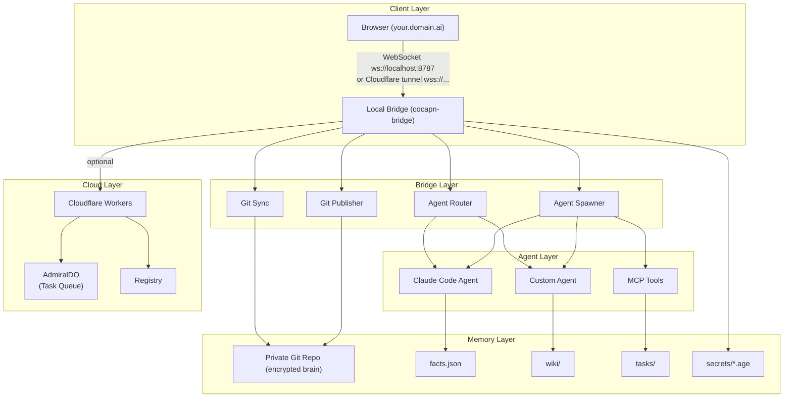

# Cocapn

> Your data is in Git. You own it completely.

Cocapn is a **repo-first hybrid agent OS** — a local WebSocket bridge that runs Claude Code, Pi, and other CLI agents on your machine, backed by an encrypted private Git repository, with an optional Cloudflare edge tier for 24/7 background tasks.

## Architecture Overview



## How Updates Become Social: The Viral Loop

Cocapn transforms personal updates into social content through a seamless workflow:

1. **You interact with your agent** — Chat, write notes, or complete tasks in your private UI
2. **Agent commits to Git** — Every action is auto-committed to your private repo
3. **Publisher detects changes** — New commits trigger the publisher
4. **Selective publishing** — Public content (wiki entries, blog posts) is pushed to your public repo
5. **GitHub Pages deploys** — Your public repo is automatically served at `your.domain.ai`
6. **Fleet discovers updates** — Other Cocapn instances can discover and follow your content
7. **Social engagement** — Others can comment, reference, or build on your published content

**Privacy by design:**
- `private.*` facts never leave your private repo
- Secrets are age-encrypted and never transmitted
- You control exactly what gets published

## Philosophy

- **Git is the database.** Every agent action, wiki entry, and task is a commit. You can `git log` your brain.
- **Local-first.** The bridge runs on your machine. No cloud required — Cloudflare is opt-in for background tasks.
- **You own the keys.** Secrets are age-encrypted in your private repo. The bridge never sends plaintext secrets anywhere.
- **Domain-branded.** Your instance lives at `you.makerlog.ai`, `you.studylog.ai`, or your own domain — served from your GitHub Pages.

## Themed Domains

Cocapn supports 11 themed domains, each with curated templates and personality:

| Domain | Focus | Onboarding |
|--------|-------|------------|
| **personallog.ai** | Generic personal assistant | Simplest |
| **businesslog.ai** | Professional/enterprise | Docker defaults, enterprise add-ons |
| **makerlog.ai** | Developers & manufacturers | Dev templates |
| **studylog.ai** | Education & research | Education templates |
| **dmlog.ai** | TTRPG | Game console UI |
| **activelog.ai** | Health & fitness | Fitness tracking |
| **activeledger.ai** | Finance & crypto | Finance tools |
| **fishinglog.ai** | Commercial & recreational fishing | Commercial vs recreational fork |
| **playerlog.ai** | Video gamers | Gaming focus |
| **reallog.ai** | Journalists & documentarians | Media tools |
| **Custom domain** | Your brand | Full customization |

**All features are installable on any domain.** Templates are curated starting points with personality, prompts, and default modules pre-configured.

## Quickstart

### Prerequisites

- Node.js 20+
- Git
- A GitHub account (for repo creation and PAT auth)
- `age` CLI (`brew install age` or `apt install age`) — for secret management

### Install and init

Run a single command — it will ask for your GitHub PAT, create and clone both repos, generate an age keypair, and print your subdomain URL.

```bash
npx create-cocapn my-makerlog --domain makerlog
```

```bash
# Or for a custom domain:
npx create-cocapn my-log --domain studylog

# After setup, start the bridge manually:
cocapn-bridge --repo ./my-makerlog-brain
```

## Repository Structure

```
cocapn/
├── packages/
│   ├── local-bridge/   # WebSocket server, agent spawner, Git sync
│   ├── ui/             # React SPA (domain-skinned)
│   ├── protocols/      # Shared MCP + A2A implementations
│   └── cloud-agents/   # Optional Cloudflare Workers
├── templates/
│   ├── public/         # Template for your public GitHub repo
│   └── private/        # Template for your private encrypted repo
├── modules/            # Reference extension modules
│   ├── habit-tracker/
│   ├── perplexity-search/
│   └── zotero-bridge/
└── docs/               # Documentation site
```

## Modules

Extend Cocapn with git-submodule-based modules:

```bash
# Add a module
cocapn-bridge module add https://github.com/cocapn/habit-tracker

# List installed modules
cocapn-bridge module list

# Or from a chat message: "install habit-tracker"
```

Module types: `skin` (CSS themes), `agent` (new AI agents), `tool` (MCP servers), `integration` (webhooks/sync).

## Security

```bash
# Initialize age keypair
cocapn-bridge secret init

# Add an encrypted secret
cocapn-bridge secret add OPENAI_API_KEY

# Rotate all secrets with a new keypair
cocapn-bridge secret rotate

# Store GitHub token in OS keychain
cocapn-bridge token set
```

All secrets are age-encrypted at rest in your private repo. Agent subprocesses only receive `COCAPN_*` variables — host secrets (AWS, OpenAI, GitHub tokens) are stripped. Every sensitive action is recorded in `cocapn/audit.log`.

## Documentation

- [Architecture](docs/architecture.md)
- [Agent Guide](docs/agents.md)
- [Skins & Domains](docs/skins.md)
- [Fleet & Multi-device](docs/fleet.md)
- [Security](docs/security.md)
- [Troubleshooting](docs/troubleshooting.md)
- [Error Codes](docs/ERROR-CODES.md)

## License

MIT
