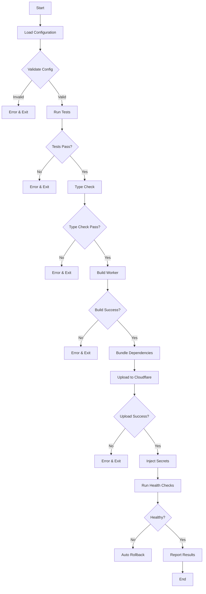
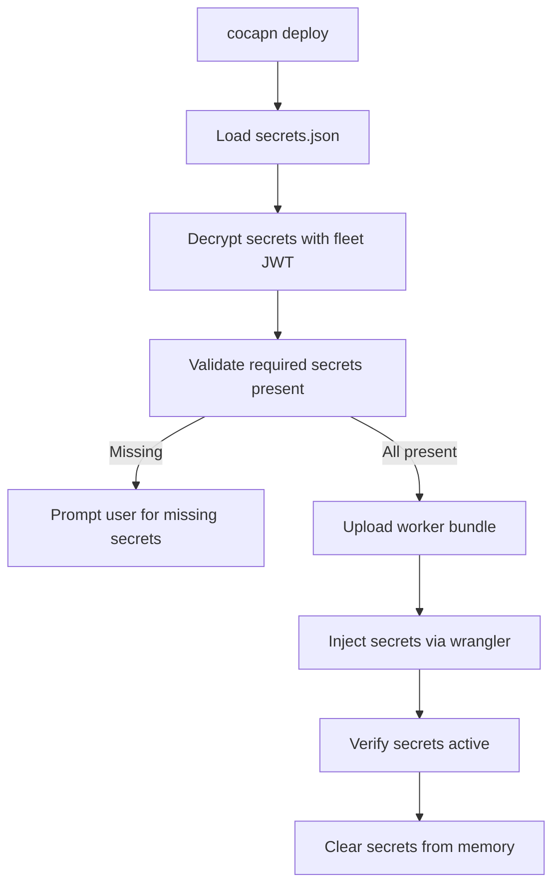
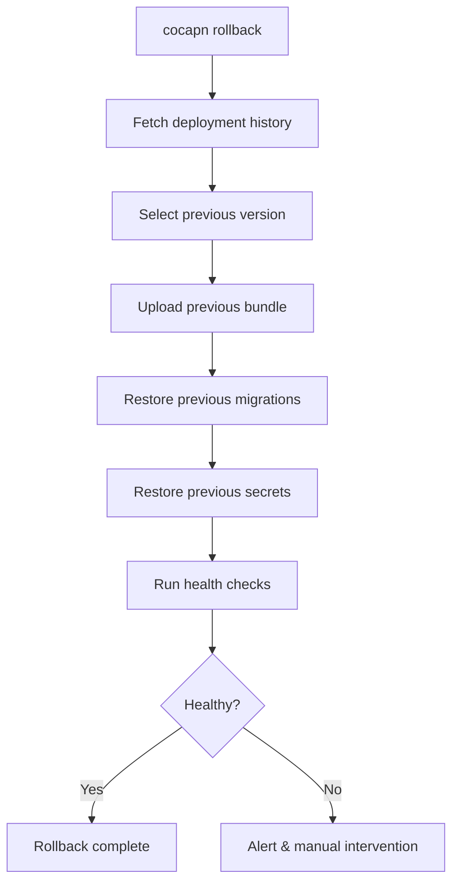

# Cocapn Deploy Flow — Design Document

## 1. Overview

**`cocapn deploy`** — one command to push a themed cocapn instance to Cloudflare Workers.

### Target Experience
```bash
$ cocapn deploy
✓ Building worker...
✓ Running tests...
✓ Bundling dependencies...
✓ Uploading to Cloudflare Workers...
✓ Running health checks...

🚀 Deployed to: https://my-makerlog.magnus-digennaro.workers.dev
   Startup time: 45ms
   Bundle size: 127KB
   Region: auto (nearest edge)
```

### Deployment Model
- **Initial phase**: Free workers.dev subdomains (e.g., `my-instance.magnus-digennaro.workers.dev`)
- **Future phase**: Custom domains via superinstance Cloudflare account (e.g., `my-makerlog.ai`)
- **Zero-config**: Sensible defaults work out of the box
- **Progressive enhancement**: Advanced options available via flags

### Key Principles
1. **Fast deployment**: Target < 30 seconds from command to live
2. **Safety first**: Validation before upload, rollback on failure
3. **Privacy by default**: Secrets never committed, encrypted at rest
4. **Observable**: Health checks, analytics, error tracking from day one

---

## 2. Deploy Command

### 2.1 Basic Usage

```bash
cocapn deploy [options]
```

### 2.2 Options

| Flag | Type | Default | Description |
|------|------|---------|-------------|
| `--env` | string | `production` | Environment: `production`, `staging`, `preview` |
| `--region` | string | `auto` | Cloudflare region: `auto`, `wnam`, `enam`, `weur`, etc. |
| `--secrets` | string | `~/.cocapn/secrets.json` | Path to secrets file |
| `--no-verify` | boolean | `false` | Skip post-deploy health checks |
| `--no-tests` | boolean | `false` | Skip pre-deploy tests |
| `--dry-run` | boolean | `false` | Build and validate without uploading |
| `--verbose` | boolean | `false` | Detailed logging |

### 2.3 Examples

```bash
# Basic deployment
cocapn deploy

# Deploy to staging
cocapn deploy --env staging

# Deploy to specific region
cocapn deploy --region weur

# Deploy with custom secrets file
cocapn deploy --secrets ./prod-secrets.json

# Dry run (build + validate only)
cocapn deploy --dry-run

# Deploy without tests (fast but risky)
cocapn deploy --no-tests
```

---

## 3. What Deploy Does

### 3.1 Deployment Pipeline



### 3.2 Step-by-Step

#### 1. Load Configuration
- Read `cocapn.json` from project root
- Merge with `cocapn.{env}.json` if exists
- Load secrets from `~/.cocapn/secrets.json`
- Validate against JSON schema

#### 2. Validate Configuration
```typescript
interface DeployConfig {
  name: string;                    // Required: "my-makerlog"
  template: string;                // Required: "makerlog"
  deploy: {
    account: string;               // Required: Cloudflare account ID
    region: string;                // Default: "auto"
    compatibilityDate: string;     // Default: "2024-12-05"
    vars: Record<string, string>;  // Environment variables
    durableObjects: string[];      // Durable Object classes
    kvNamespaces: string[];        // KV namespace bindings
    d1Databases: string[];         // D1 database bindings
  };
}
```

#### 3. Run Tests (unless `--no-tests`)
```bash
npx vitest run --reporter=verbose
```
- Exit if any test fails
- Show test coverage summary
- Skip if `--no-tests` flag present

#### 4. Type Check
```bash
npx tsc --noEmit
```
- Ensure TypeScript compilation succeeds
- Catch type errors before deployment

#### 5. Build Worker
```bash
npx esbuild src/worker.ts \
  --bundle \
  --format=esm \
  --target=esnext \
  --platform=browser \
  --outfile=dist/worker.js
```

**Build output:**
```
✓ Built dist/worker.js (127KB)
✓ Minified: 87KB
✓ Gzipped: 23KB
```

#### 6. Bundle Dependencies
- Inline all dependencies into single worker.js
- External Cloudflare runtime (provided by Workers)
- Mark Node.js builtins as external (not available in Workers)

#### 7. Upload to Cloudflare
```bash
npx wrangler deploy --env production
```

**Upload progress:**
```
✓ Uploading worker bundle...
✓ Creating D1 database: my-makerlog-db
✓ Running migrations...
✓ Binding Durable Objects: AdmiralDO
✓ Publishing to Cloudflare...
```

#### 8. Inject Secrets
```bash
npx wrangler secret put API_KEY --env production
npx wrangler secret put FLEET_JWT --env production
# ... (one per secret in config)
```

**Secret injection progress:**
```
✓ Injected 3 secrets
  - API_KEY
  - FLEET_JWT
  - DEEPSEEK_API_KEY
```

#### 9. Run Health Checks
```bash
curl -f https://my-makerlog.magnus-digennaro.workers.dev/_health
```

**Health check response:**
```json
{
  "status": "healthy",
  "version": "1.0.0",
  "timestamp": "2026-03-29T12:34:56Z",
  "startup_time": 45,
  "memory_usage": "128MB"
}
```

#### 10. Report Results
```
🚀 Deployed to: https://my-makerlog.magnus-digennaro.workers.dev

📊 Metrics:
   Startup time: 45ms
   Bundle size: 127KB (minified: 87KB, gzipped: 23KB)
   Region: auto (nearest edge)
   Workers version: 2024.12.5

🔗 Links:
   Live: https://my-makerlog.magnus-digennaro.workers.dev
   Dashboard: https://dash.cloudflare.com/...
   Logs: npx wrangler tail --env production

📈 Next steps:
   - Set up custom domain: cocapn domain --add my-makerlog.ai
   - Enable analytics: cocapn analytics enable
   - Configure CI/CD: cocapn ci setup
```

---

## 4. Configuration

### 4.1 Project Configuration (`cocapn.json`)

```json
{
  "$schema": "https://cocapn.com/schemas/deploy.json",
  "name": "my-makerlog",
  "version": "1.0.0",
  "template": "makerlog",
  "description": "My personal build log",
  "author": "magnus-digennaro",
  "license": "MIT",

  "deploy": {
    "account": "magnus-digennaro",
    "account_id": "abc123def456",
    "region": "auto",
    "compatibility_date": "2024-12-05",
    "compatibility_flags": ["nodejs_compat"],

    "environments": {
      "production": {
        "route": "my-makerlog.magnus-digennaro.workers.dev",
        "vars": {
          "PUBLIC_URL": "https://my-makerlog.magnus-digennaro.workers.dev",
          "BRIDGE_MODE": "cloud"
        }
      },
      "staging": {
        "route": "staging.my-makerlog.magnus-digennaro.workers.dev",
        "vars": {
          "PUBLIC_URL": "https://staging.my-makerlog.magnus-digennaro.workers.dev",
          "BRIDGE_MODE": "cloud"
        }
      }
    },

    "vars": {
      "PRIVATE_REPO": "magnus-digennaro/my-makerlog-private",
      "PUBLIC_REPO": "magnus-digennaro/my-makerlog",
      "BRIDGE_MODE": "cloud",
      "TEMPLATE": "makerlog",
      "DOMAIN": "makerlog.ai"
    },

    "secrets": {
      "required": ["FLEET_JWT", "DEEPSEEK_API_KEY"],
      "optional": ["OPENAI_API_KEY", "ANTHROPIC_API_KEY"]
    },

    "durable_objects": [
      {
        "name": "ADMIRAL",
        "class_name": "AdmiralDO",
        "script_name": "cocapn-agent"
      }
    ],

    "kv_namespaces": [
      {
        "name": "MY_MAKERLOG_KV",
        "binding": "KV_CACHE"
      }
    ],

    "d1_databases": [
      {
        "name": "my-makerlog-db",
        "binding": "DB"
      }
    ],

    "migrations": [
      {
        "tag": "v1",
        "new_sqlite_classes": ["AdmiralDO"]
      }
    ]
  }
}
```

### 4.2 Environment-Specific Configs

**`cocapn.production.json`** (overrides for production):
```json
{
  "deploy": {
    "vars": {
      "LOG_LEVEL": "info"
    }
  }
}
```

**`cocapn.staging.json`** (overrides for staging):
```json
{
  "deploy": {
    "vars": {
      "LOG_LEVEL": "debug"
    }
  }
}
```

### 4.3 Template Configuration

Templates provide default deploy configs. Users inherit and override.

**Example: `templates/makerlog/cocapn.json`**
```json
{
  "name": "makerlog",
  "version": "1.0.0",
  "template": "makerlog",
  "description": "Build log for developers and manufacturers",

  "deploy": {
    "region": "auto",
    "compatibility_date": "2024-12-05",

    "vars": {
      "TEMPLATE": "makerlog",
      "DOMAIN": "makerlog.ai",
      "BRIDGE_MODE": "cloud"
    },

    "durable_objects": [
      {
        "name": "ADMIRAL",
        "class_name": "AdmiralDO"
      }
    ],

    "d1_databases": [
      {
        "name": "makerlog-db",
        "binding": "DB"
      }
    ]
  }
}
```

---

## 5. Secrets Management

### 5.1 Secrets Storage

**Location**: `~/.cocapn/secrets.json`

**Format**:
```json
{
  "version": 1,
  "encrypted": true,
  "accounts": {
    "magnus-digennaro": {
      "cloudflare_api_token": "encrypted:...",
      "fleet_jwt": "encrypted:...",
      "secrets": {
        "DEEPSEEK_API_KEY": "encrypted:...",
        "ANTHROPIC_API_KEY": "encrypted:..."
      }
    }
  }
}
```

### 5.2 Encryption

- **Encryption method**: Age encryption (using fleet JWT private key)
- **Key derivation**: Fleet JWT private key → encryption key
- **Algorithm**: ChaCha20-Poly1305 (via age-encryption package)

### 5.3 Secret Injection Flow



### 5.4 Secret Prompting

When required secrets are missing:

```bash
$ cocapn deploy

⚠️  Missing required secrets for deployment:

   📝 DEEPSEEK_API_KEY (required)
      Your DeepSeek API key for agent LLM calls.
      Get one at: https://platform.deepseek.com/api-keys

   Enter key: ********************************

✓ Secret saved to ~/.cocapn/secrets.json (encrypted)
✓ Proceeding with deployment...
```

### 5.5 Template Secret Prompts

Templates declare required secrets. CLI prompts user during init.

**`cocapn-template.json` secret schema**:
```json
{
  "secrets": {
    "required": [
      {
        "name": "DEEPSEEK_API_KEY",
        "description": "Your DeepSeek API key for agent LLM calls",
        "help_url": "https://platform.deepseek.com/api-keys",
        "label": "DeepSeek API Key"
      }
    ],
    "optional": [
      {
        "name": "OPENAI_API_KEY",
        "description": "OpenAI API key (for GPT-4 access)",
        "help_url": "https://platform.openai.com/api-keys",
        "label": "OpenAI API Key"
      }
    ]
  }
}
```

### 5.6 Secret Security

- **Never committed**: `secrets.json` in `.gitignore`
- **Encrypted at rest**: Age encryption with fleet JWT
- **Memory safety**: Secrets cleared from memory after injection
- **Auditing**: Log secret injections (no values) to audit trail
- **Rotation**: `cocapn secrets rotate <key>` command

---

## 6. Environment Management

### 6.1 Environments

| Environment | Subdomain Pattern | Use Case |
|-------------|-------------------|----------|
| `production` | `my-instance.workers.dev` | Live deployment |
| `staging` | `staging.my-instance.workers.dev` | Pre-production testing |
| `preview` | `preview-{commit}.my-instance.workers.dev` | PR previews |

### 6.2 Environment Commands

```bash
# Deploy to specific environment
cocapn deploy --env staging

# List all environments
cocapn env list

# Create new environment
cocapn env create preview --template staging

# Delete environment
cocapn env delete preview --force
```

### 6.3 Environment Configuration

**`cocapn.staging.json`**:
```json
{
  "deploy": {
    "route": "staging.my-makerlog.magnus-digennaro.workers.dev",
    "vars": {
      "PUBLIC_URL": "https://staging.my-makerlog.magnus-digennaro.workers.dev",
      "LOG_LEVEL": "debug",
      "FEATURE_FLAGS": "beta_features,experimental_ui"
    }
  }
}
```

### 6.4 Preview Deployments (CI/CD)

**GitHub Actions workflow**:
```yaml
name: Deploy Preview

on:
  pull_request:
    types: [opened, synchronize]

jobs:
  preview:
    runs-on: ubuntu-latest
    steps:
      - uses: actions/checkout@v4
      - uses: actions/setup-node@v4
        with:
          node-version: '20'
          cache: 'npm'

      - name: Install cocapn
        run: npm install -g @cocapn/cli

      - name: Deploy preview
        run: cocapn deploy --env preview --no-verify
        env:
          CLOUDFLARE_API_TOKEN: ${{ secrets.CLOUDFLARE_API_TOKEN }}
          CLOUDFLARE_ACCOUNT_ID: ${{ secrets.CLOUDFLARE_ACCOUNT_ID }}

      - name: Comment preview URL
        uses: actions/github-script@v7
        with:
          script: |
            github.rest.issues.createComment({
              issue_number: context.issue.number,
              owner: context.repo.owner,
              repo: context.repo.repo,
              body: '🚀 Preview deployed to: https://preview-${{ github.sha }}.my-instance.workers.dev'
            })
```

---

## 7. Database Provisioning

### 7.1 D1 Database Auto-Creation

```bash
$ cocapn deploy

✓ Creating D1 database: my-makerlog-db...
✓ Database created: 789xyz123-abc-456-def-789xyz123
```

**Wrangler commands**:
```bash
# Create database
npx wrangler d1 create my-makerlog-db

# List databases
npx wrangler d1 list

# Delete database
npx wrangler d1 delete my-makerlog-db --force
```

### 7.2 Migrations

**Migration file structure**:
```
migrations/
├── 0001_initial.sql
├── 0002_add_sessions.sql
├── 0003_add_analytics.sql
└── ...
```

**Migration on deploy**:
```bash
# Run all pending migrations
npx wrangler d1 migrations apply my-makerlog-db --remote
```

**Example migration**:
```sql
-- migrations/0001_initial.sql
-- Create initial schema

-- Users table
CREATE TABLE IF NOT EXISTS users (
  id TEXT PRIMARY KEY,
  github_id TEXT UNIQUE NOT NULL,
  username TEXT NOT NULL,
  created_at DATETIME DEFAULT CURRENT_TIMESTAMP
);

-- Sessions table (Durable Object storage)
CREATE TABLE IF NOT EXISTS sessions (
  id TEXT PRIMARY KEY,
  user_id TEXT NOT NULL,
  data TEXT NOT NULL, -- JSON
  updated_at DATETIME DEFAULT CURRENT_TIMESTAMP,
  FOREIGN KEY (user_id) REFERENCES users(id)
);
```

### 7.3 Seed Data

**Template seed data**: `templates/makerlog/seed.sql`

```sql
-- Insert default personality
INSERT INTO personalities (slug, name, content) VALUES (
  'makerlog',
  'Makerlog Personality',
  'You are a build log assistant for developers...'
);

-- Insert sample routes
INSERT INTO routes (pattern, handler, weight) VALUES
  ('^/projects.*', 'project_handler', 1.0),
  ('^/releases.*', 'release_handler', 1.0),
  ('^/sidehustles.*', 'project_handler', 0.8);
```

**Seed on deploy**:
```bash
# Seed database (after migrations)
npx wrangler d1 execute my-makerlog-db --file=seed.sql --remote
```

### 7.4 Database Management Commands

```bash
# Query database
cocapn db query "SELECT * FROM users"

# Backup database
cocapn db backup my-makerlog.db

# Restore database
cocapn db restore my-makerlog.db

# Drop all tables (dangerous!)
cocapn db reset --force
```

---

## 8. CI/CD Integration

### 8.1 GitHub Actions Template

**`.github/workflows/deploy.yml`** (included in template):
```yaml
name: Deploy

on:
  push:
    branches: [main]
  pull_request:
    types: [opened, synchronize]

jobs:
  test:
    runs-on: ubuntu-latest
    steps:
      - uses: actions/checkout@v4
      - uses: actions/setup-node@v4
        with:
          node-version: '20'
          cache: 'npm'

      - name: Install dependencies
        run: npm ci

      - name: Type check
        run: npm run typecheck

      - name: Run tests
        run: npm test

      - name: Build
        run: npm run build

  deploy-preview:
    if: github.event_name == 'pull_request'
    needs: test
    runs-on: ubuntu-latest
    steps:
      - uses: actions/checkout@v4

      - name: Deploy preview
        run: npx cocapn deploy --env preview
        env:
          CLOUDFLARE_API_TOKEN: ${{ secrets.CLOUDFLARE_API_TOKEN }}
          CLOUDFLARE_ACCOUNT_ID: ${{ secrets.CLOUDFLARE_ACCOUNT_ID }}

      - name: Comment preview URL
        uses: actions/github-script@v7
        with:
          script: |
            github.rest.issues.createComment({
              issue_number: context.issue.number,
              owner: context.repo.owner,
              repo: context.repo.repo,
              body: '🚀 Preview: https://preview-${{ github.sha }}.my-makerlog.workers.dev'
            })

  deploy-production:
    if: github.event_name == 'push' && github.ref == 'refs/heads/main'
    needs: test
    runs-on: ubuntu-latest
    steps:
      - uses: actions/checkout@v4

      - name: Deploy production
        run: npx cocapn deploy --env production
        env:
          CLOUDFLARE_API_TOKEN: ${{ secrets.CLOUDFLARE_API_TOKEN }}
          CLOUDFLARE_ACCOUNT_ID: ${{ secrets.CLOUDFLARE_ACCOUNT_ID }}

      - name: Notify Slack
        uses: 8398a7/action-slack@v3
        with:
          status: ${{ job.status }}
          text: '🚀 Deployed to production: https://my-makerlog.workers.dev'
          webhook_url: ${{ secrets.SLACK_WEBHOOK }}
```

### 8.2 Required GitHub Secrets

Users configure these in GitHub repo settings:

| Secret | Description | Get from |
|--------|-------------|----------|
| `CLOUDFLARE_API_TOKEN` | Cloudflare API token | Cloudflare Dashboard → My Profile → API Tokens |
| `CLOUDFLARE_ACCOUNT_ID` | Cloudflare account ID | Cloudflare Dashboard → Workers → Overview |
| `SLACK_WEBHOOK` | Slack webhook for notifications | Slack App settings (optional) |

### 8.3 CI/CD Setup Command

```bash
$ cocapn ci setup

✓ Detecting CI/CD platform...
   Found: GitHub Actions

✓ Creating .github/workflows/deploy.yml...
✓ Creating .github/workflows/test.yml...

⚠️  Required secrets:
   → CLOUDFLARE_API_TOKEN
   → CLOUDFLARE_ACCOUNT_ID

   Set them at: https://github.com/magnus-digennaro/my-makerlog/settings/secrets

✓ CI/CD configured!
   Next commit to main will auto-deploy.
```

---

## 9. Monitoring

### 9.1 Built-in Workers Analytics

**Access via dashboard**:
```
https://dash.cloudflare.com/.../workers/analytics
```

**Metrics tracked**:
- Request count
- Error rate
- Response time (p50, p95, p99)
- CPU usage
- Memory usage
- Edge location distribution

### 9.2 Custom Health Check Endpoint

**Endpoint**: `/_health`

**Response**:
```json
{
  "status": "healthy",
  "version": "1.0.0",
  "timestamp": "2026-03-29T12:34:56Z",
  "startup_time": 45,
  "memory_usage": "128MB",
  "checks": {
    "database": "ok",
    "durable_objects": "ok",
    "kv": "ok"
  }
}
```

**Implementation** (in worker):
```typescript
export interface Env {
  DB: D1Database;
  ADMIRAL: DurableObjectNamespace;
  KV: KVNamespace;
}

export default {
  async fetch(request: Request, env: Env): Promise<Response> {
    const url = new URL(request.url);

    if (url.pathname === '/_health') {
      const checks = {
        database: await pingDatabase(env.DB),
        durable_objects: await pingDurableObjects(env.ADMIRAL),
        kv: await pingKV(env.KV),
      };

      const status = Object.values(checks).every(c => c === 'ok') ? 'healthy' : 'degraded';

      return Response.json({
        status,
        version: '1.0.0',
        timestamp: new Date().toISOString(),
        checks,
      });
    }

    // ... rest of worker logic
  },
};
```

### 9.3 Error Rate Alerting

**Cron Trigger** (runs every 5 minutes):
```typescript
// src/monitors/error-rate.ts
export default {
  async scheduled(event: ScheduledEvent, env: Env): Promise<void> {
    const analytics = await getErrorMetrics(env);

    if (analytics.error_rate > 0.05) { // 5% error threshold
      await sendSlackAlert({
        text: `🚨 High error rate: ${analytics.error_rate}%`,
        attachments: [{
          color: 'danger',
          fields: [
            { title: 'Error Rate', value: `${analytics.error_rate}%`, short: true },
            { title: 'Errors', value: analytics.error_count.toString(), short: true },
            { title: 'Requests', value: analytics.request_count.toString(), short: true },
          ],
        }],
      }, env.SLACK_WEBHOOK);
    }
  },
};
```

### 9.4 Monitoring Commands

```bash
# Tail real-time logs
cocapn logs tail

# Get error rate
cocapn metrics error-rate

# Get response times
cocapn metrics response-time

# Set up alerting
cocapn alerts create --type error-rate --threshold 5% --webhook https://...
```

---

## 10. Rollback

### 10.1 Rollback Command

```bash
# Rollback to previous version
cocapn rollback

# Rollback to specific version
cocapn rollback --version v1.2.3

# Rollback with confirmation
cocapn rollback --confirm

# Rollback and verify
cocapn rollback --verify
```

### 10.2 Rollback Flow



### 10.3 Wrangler Rollback

```bash
# List deployments
npx wrangler deployments list --env production

# Rollback to previous deployment
npx wrangler rollback --env production
```

### 10.4 Automatic Rollback

On health check failure, auto-rollback to previous version:

```typescript
// src/deploy/health-check.ts
export async function deployWithAutoRollback(
  bundle: string,
  env: string
): Promise<void> {
  const previousVersion = await getCurrentVersion(env);

  try {
    await uploadBundle(bundle, env);
    const healthy = await runHealthChecks(env);

    if (!healthy) {
      console.log('❌ Health checks failed, rolling back...');
      await rollbackTo(previousVersion, env);
      throw new Error('Deployment failed, rolled back');
    }
  } catch (error) {
    console.error('❌ Deployment error:', error);
    await rollbackTo(previousVersion, env);
    throw error;
  }
}
```

### 10.5 Rollback Verification

```bash
$ cocapn rollback --verify

✓ Rolling back to v1.2.3...
✓ Uploaded previous bundle
✓ Restored migrations
✓ Health checks passed
✓ Rollback complete!

Current version: v1.2.3
URL: https://my-makerlog.workers.dev
```

---

## 11. Multi-Tenant Architecture (Future)

### 11.1 Shared Worker, Isolated Data

**Architecture**:
```
┌─────────────────────────────────────┐
│   Shared Worker Code                │
│   (one deployment, many tenants)    │
└─────────────────────────────────────┘
         │         │         │
         ▼         ▼         ▼
    ┌────────┐ ┌────────┐ ┌────────┐
    │  DB 1  │ │  DB 2  │ │  DB 3  │
    │(user A)│ │(user B)│ │(user C)│
    └────────┘ └────────┘ └────────┘
```

### 11.2 Tenant Isolation

- **Per-tenant D1 database**: Each user gets their own database
- **Fleet JWT per tenant**: Authentication scoped to tenant
- **KV namespace per tenant**: Isolated cache storage
- **Durable Objects per tenant**: Separate DO instances

### 11.3 Tenant Routing

```typescript
// src/worker.ts
export default {
  async fetch(request: Request, env: Env): Promise<Response> {
    const url = new URL(request.url);
    const subdomain = url.hostname.split('.')[0]; // e.g., "user-a"

    // Route to tenant-specific database
    const tenantDB = await getTenantDatabase(subdomain, env);
    const tenantKV = await getTenantKV(subdomain, env);

    // Process request with tenant resources
    return handleRequest(request, { db: tenantDB, kv: tenantKV });
  },
};
```

### 11.4 Multi-Tenant Provisioning

```bash
# Provision new tenant
cocapn tenants create user-a \
  --domain user-a.makerlog.ai \
  --database user-a-db \
  --kv user-a-kv

# List tenants
cocapn tenants list

# Delete tenant
cocapn tenants delete user-a --force
```

### 11.5 Superinstance Management

For custom domains via superinstance Cloudflare account:

```bash
# Connect to superinstance
cocapn superinstance connect \
  --account-id superinstance-account-id \
  --api-token superinstance-api-token

# Deploy to custom domain
cocapn deploy --domain my-makerlog.ai
```

---

## 12. Implementation Phases

### Phase 1: Core Deploy (Week 1)
- [ ] `cocapn deploy` basic command
- [ ] Build pipeline (esbuild)
- [ ] Upload to Cloudflare (wrangler)
- [ ] Health check endpoint
- [ ] Basic error handling

### Phase 2: Configuration (Week 1-2)
- [ ] `cocapn.json` schema validation
- [ ] Environment management (prod/staging/preview)
- [ ] Template-based configs
- [ ] Secret prompting

### Phase 3: Database (Week 2)
- [ ] D1 auto-provisioning
- [ ] Migration system
- [ ] Seed data from templates
- [ ] Database management commands

### Phase 4: CI/CD (Week 2-3)
- [ ] GitHub Actions workflow template
- [ ] Preview deployments
- [ ] Auto-deploy on main push
- [ ] Slack notifications

### Phase 5: Monitoring (Week 3)
- [ ] Custom health checks
- [ ] Error rate alerting
- [ ] Log tailing command
- [ ] Metrics dashboard

### Phase 6: Rollback (Week 3-4)
- [ ] Manual rollback command
- [ ] Auto-rollback on failure
- [ ] Deployment history
- [ ] Rollback verification

### Phase 7: Secrets (Week 4)
- [ ] Encrypted secrets storage
- [ ] Secret injection
- [ ] Secret rotation
- [ ] Template secret schemas

### Phase 8: Multi-Tenant (Future)
- [ ] Per-tenant databases
- [ ] Tenant routing
- [ ] Superinstance integration
- [ ] Custom domain support

---

## 13. Error Handling

### 13.1 Deploy Error Codes

| Code | Description | Resolution |
|------|-------------|------------|
| `E001` | Missing `cocapn.json` | Run `cocapn init` |
| `E002` | Invalid JSON schema | Fix `cocapn.json` |
| `E003` | Tests failed | Fix failing tests |
| `E004` | Type check failed | Fix TypeScript errors |
| `E005` | Build failed | Fix build errors |
| `E006` | Upload failed | Check Cloudflare credentials |
| `E007` | Missing secret | Run `cocapn secrets add` |
| `E008` | Health check failed | Check logs, rollback |
| `E009` | Migration failed | Fix migration SQL |
| `E010` | Database error | Check database status |

### 13.2 Error Messages

**User-friendly error messages**:
```bash
$ cocapn deploy

❌ Deployment failed

Error: Missing required secret: DEEPSEEK_API_KEY

This secret is required for the makerlog template.

Get your API key at: https://platform.deepseek.com/api-keys

Then run:
   cocapn secrets add DEEPSEEK_API_KEY

For help, see: https://docs.cocapn.com/deploy/secrets
```

### 13.3 Debug Mode

```bash
# Enable verbose logging
cocapn deploy --verbose

# Enable debug mode
cocapn deploy --debug

# Save logs to file
cocapn deploy 2>&1 | tee deploy.log
```

---

## 14. Security Considerations

### 14.1 Secrets Security
- **Never log secrets**: Sanitized logging
- **Encrypt at rest**: Age encryption
- **Memory safety**: Clear secrets after use
- **Audit trail**: Log secret access (no values)

### 14.2 Deploy Security
- **API tokens**: Use Cloudflare API tokens (not account keys)
- **Least privilege**: Scoped API tokens for Workers only
- **Token rotation**: Rotate tokens periodically
- **IP restrictions**: Restrict API token IPs (optional)

### 14.3 Database Security
- **Isolation**: Per-tenant databases
- **Encryption**: D1 databases encrypted at rest
- **Backups**: Automated daily backups
- **Access control**: Fleet JWT-based access

### 14.4 Network Security
- **HTTPS only**: Force HTTPS on Workers
- **CORS**: Configure CORS for custom domains
- **Rate limiting**: Implement rate limiting per tenant
- **DDoS protection**: Cloudflare DDoS protection

---

## 15. Performance Optimization

### 15.1 Build Performance
- **Incremental builds**: Cache esbuild builds
- **Parallel builds**: Build multiple workers in parallel
- **Minification**: Minify bundle for faster uploads
- **Compression**: Gzip bundle for smaller size

### 15.2 Deploy Performance
- **Delta uploads**: Upload only changed files (future)
- **Parallel uploads**: Upload to multiple regions (future)
- **Cached uploads**: Skip upload if bundle unchanged (future)

### 15.3 Runtime Performance
- **Edge caching**: Cache static assets at edge
- **Warm starts**: Keep workers warm with scheduled pings
- **Database connection pooling**: Reuse D1 connections
- **KV caching**: Cache frequently accessed data in KV

---

## 16. Testing Strategy

### 16.1 Unit Tests
- Test deploy pipeline components
- Mock Cloudflare API calls
- Test error handling paths

### 16.2 Integration Tests
- Test deploy to staging environment
- Test rollback scenarios
- Test health checks

### 16.3 E2E Tests
- Deploy test instance
- Run smoke tests
- Verify functionality
- Clean up test instance

### 16.4 Load Tests
- Deploy to staging
- Run load tests (k6, Artillery)
- Measure response times
- Identify bottlenecks

---

## 17. Documentation

### 17.1 User Documentation
- **Quick start**: Deploy your first instance in 5 minutes
- **Configuration**: Complete `cocapn.json` reference
- **Secrets**: Secrets management guide
- **CI/CD**: CI/CD setup guide
- **Monitoring**: Monitoring and alerting guide
- **Troubleshooting**: Common issues and solutions

### 17.2 Developer Documentation
- **Architecture**: Deploy system architecture
- **API reference**: Deploy CLI API reference
- **Contributing**: Contributing to deploy system
- **Testing**: Testing strategy and guidelines

### 17.3 Template Documentation
- **Template authoring**: Create deploy-ready templates
- **Template schema**: `cocapn-template.json` reference
- **Best practices**: Template design patterns

---

## 18. Future Enhancements

### 18.1 Short-term (Next 3 months)
- **Custom domains**: Deploy to custom domains via superinstance
- **Blue-green deployment**: Zero-downtime deployments
- **Canary deployments**: Gradual rollout of new versions
- **A/B testing**: Test multiple versions simultaneously

### 18.2 Medium-term (3-6 months)
- **Multi-region deployment**: Deploy to multiple regions
- **Auto-scaling**: Scale based on traffic
- **Cost optimization**: Optimize Workers usage and costs
- **Performance monitoring**: Advanced performance insights

### 18.3 Long-term (6-12 months)
- **Self-hosted deployment**: Deploy to non-Cloudflare platforms
- **Hybrid deployment**: Cloud + local bridge deployment
- **Fleet deployment**: Deploy fleet of instances
- **Enterprise features**: SSO, audit logs, compliance

---

## 19. Success Metrics

### 19.1 Technical Metrics
- **Deploy time**: < 30 seconds from command to live
- **Success rate**: > 99% deploy success rate
- **Rollback time**: < 10 seconds to rollback
- **Uptime**: > 99.9% uptime

### 19.2 User Metrics
- **First deploy success**: > 95% first-time deploy success
- **Time to first deploy**: < 5 minutes from install to deploy
- **Support tickets**: < 5% of users need deploy support

### 19.3 Business Metrics
- **Active deployments**: Number of active deployments
- **Deployment frequency**: Average deployments per user per week
- **User retention**: % of users who deploy more than once

---

## Appendix A: Example Deployment

### A.1 Complete Deployment Example

```bash
# Initialize new project
$ cocapn init my-makerlog --template makerlog
✓ Created repos: my-makerlog, my-makerlog-private
✓ Installed template: makerlog
✓ Configured modules: habit-tracker, perplexity-search

# Configure Cloudflare
$ cocapn cloudflare connect
Enter Cloudflare API token: ********************************
✓ Connected to account: magnus-digennaro

# Add secrets
$ cocapn secrets add DEEPSEEK_API_KEY
Enter value: ********************************
✓ Secret saved (encrypted)

# Deploy
$ cocapn deploy
✓ Building worker...
✓ Running tests (32 tests)...
✓ Type checking...
✓ Bundling dependencies...
✓ Uploading to Cloudflare...
✓ Creating D1 database: my-makerlog-db...
✓ Running migrations (3 migrations)...
✓ Seeding database...
✓ Injecting secrets (3 secrets)...
✓ Running health checks...

🚀 Deployed to: https://my-makerlog.magnus-digennaro.workers.dev

📊 Metrics:
   Startup time: 45ms
   Bundle size: 127KB
   Region: auto (nearest edge)

🔗 Next steps:
   - Set up custom domain: cocapn domain add my-makerlog.ai
   - Enable CI/CD: cocapn ci setup
   - View logs: cocapn logs tail
```

### A.2 CI/CD Deployment Example

```bash
# Push to main
$ git push origin main

# GitHub Actions runs automatically
✓ Tests passed
✓ Type check passed
✓ Build succeeded
✓ Deployed to production

# Comment on commit
🚀 Deployed to: https://my-makerlog.workers.dev
   Commit: abc123def
   Author: magnus-digennaro
   Time: 2026-03-29 12:34:56 UTC
```

---

## Appendix B: Troubleshooting

### B.1 Common Issues

**Issue**: `Error: Missing CLOUDFLARE_API_TOKEN`
**Solution**: Set Cloudflare API token in environment or run `cocapn cloudflare connect`

**Issue**: `Error: Health check failed`
**Solution**: Check logs with `cocapn logs tail`, fix issues, redeploy

**Issue**: `Error: Migration failed`
**Solution**: Fix migration SQL, run `cocapn db migrate --redo`

**Issue**: `Error: Bundle size exceeds limit (1MB)`
**Solution**: Remove unused dependencies, enable minification

### B.2 Debug Commands

```bash
# Check configuration
cocapn config validate

# Check Cloudflare connection
cocapn cloudflare test

# Check database status
cocapn db status

# Check worker logs
cocapn logs tail

# Run health checks manually
cocapn health check
```

---

**Document Version**: 1.0.0
**Last Updated**: 2026-03-29
**Author**: Cocapn Team
**Status**: Design Document
