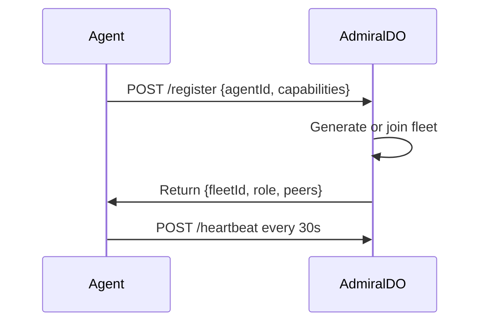

# Fleet Protocol — Multi-Agent Coordination

> **Version**: 1.0.0
> **Status**: Draft
> **Authors**: Cocapn Team
> **Last Updated**: 2026-03-29

---

## 1. Overview

### 1.1 What is a Fleet?

A **fleet** is a coordinated group of cocapn instances (bridges) that collaborate on complex tasks. Each agent in a fleet has a specific role and communicates through the A2A protocol extended with fleet-specific messages.

**Key Properties:**
- **Voluntary membership**: Agents join/leave fleets dynamically
- **Role-based coordination**: Leaders coordinate, workers execute, specialists provide domain expertise
- **Fault tolerance**: Dead agents are detected and their work reassigned
- **Scalability**: Fleets can range from 2 agents (local + cloud) to hundreds
- **Trust boundaries**: Fleet membership requires JWT-based authentication

### 1.2 Why Fleets?

| Scenario | Single Agent | Fleet |
|----------|-------------|-------|
| Parallel code review | Sequential | 3 agents review different files |
| Multi-repo deployment | One by one | Each agent handles a repo |
| Research synthesis | Single source | Agents search different sources, leader synthesizes |
| Geographic redundancy | Single point of failure | Agents across regions, leader fails over |
| Specialist expertise | Generalist | Domain specialists (legal, medical, security) |

### 1.3 Relationship to A2A

The Fleet Protocol **extends** the A2A protocol:
- A2A provides the transport layer (JSON-RPC 2.0 over HTTP)
- Fleet Protocol adds coordination messages and semantics
- Fleet messages are A2A tasks with specific metadata

---

## 2. Fleet Topology

### 2.1 Topology Types

#### Star (Default)
```
        Leader
       /   |   \
    W1    W2    W3
```
- **Single leader** coordinates all workers
- **Workers only talk to leader**
- **Pros**: Simple, fast convergence, easy to debug
- **Cons**: Leader is a bottleneck, single point of failure
- **Use case**: Most fleets, especially with < 20 agents

#### Mesh
```
    W1 —— W2
     | \  / |
     |  \/  |
    W3 —— W4
```
- **Agents can communicate directly**
- **No central coordinator**
- **Pros**: Resilient, scalable, no bottleneck
- **Cons**: Complex coordination, slow convergence, hard to debug
- **Use case**: Large fleets (> 50 agents), peer-to-peer workflows

#### Hierarchical
```
        Leader
       /     \
     SL1     SL2
     / \     / \
   W1  W2  W3  W4
```
- **Multi-level leadership**
- **Sub-leaders coordinate worker groups**
- **Pros**: Scalable, mirrors organizational structures
- **Cons**: Complex, more failure modes
- **Use case**: Large fleets with natural hierarchy (e.g., regional teams)

### 2.2 Topology Selection

| Factor | Star | Mesh | Hierarchical |
|--------|------|------|--------------|
| Fleet size | < 20 | > 50 | 20-100 |
| Coordination complexity | Low | High | Medium |
| Fault tolerance | Medium | High | High |
| Debugging difficulty | Easy | Hard | Medium |
| **Default** | **Yes** | No | No |

**Implementation Note**: Version 1.0 implements **star topology only**. Mesh and hierarchical are reserved for future versions.

---

## 3. Fleet Discovery

### 3.1 AdmiralDO as Fleet Registry

AdmiralDO (the Cloudflare Durable Object) serves as the fleet registry:

```typescript
interface FleetRegistration {
  fleetId: string;          // Unique fleet identifier
  agentId: string;          // Agent instance ID
  role: FleetRole;          // leader, worker, specialist
  capabilities: string[];   // Skills, modules, compute resources
  endpoint: string;         // A2A endpoint URL
  lastSeen: string;         // ISO timestamp of last heartbeat
  status: "active" | "idle" | "offline";
}
```

### 3.2 Agent Registration Flow



**Registration Request:**
```json
{
  "jsonrpc": "2.0",
  "id": 1,
  "method": "fleet/register",
  "params": {
    "agentId": "bridge-abc123",
    "agentCard": { ... },
    "desiredFleetId": "fleet-xyz", // optional: join existing fleet
    "preferredRole": "worker",      // optional: leader | worker | specialist
    "capabilities": {
      "skills": ["code-review", "testing"],
      "modules": ["perplexity-search", "zotero-bridge"],
      "compute": {"cpu": "4", "memory": "8GB"}
    }
  }
}
```

**Registration Response:**
```json
{
  "jsonrpc": "2.0",
  "id": 1,
  "result": {
    "fleetId": "fleet-xyz",
    "agentId": "bridge-abc123",
    "role": "worker",
    "leaderId": "bridge-def456",
    "peers": [
      {"agentId": "bridge-def456", "role": "leader", "endpoint": "https://..."},
      {"agentId": "bridge-ghi789", "role": "worker", "endpoint": "https://..."}
    ],
    "fleetJWT": "eyJhbGciOiJIUzI1NiIsInR5cCI6IkpXVCJ9..."
  }
}
```

### 3.3 Heartbeat Protocol

Every 30 seconds (configurable):

```json
{
  "jsonrpc": "2.0",
  "id": 2,
  "method": "fleet/heartbeat",
  "params": {
    "agentId": "bridge-abc123",
    "fleetId": "fleet-xyz",
    "status": "active",
    "currentTaskId": "task-123", // optional
    "load": 0.7 // CPU load 0-1
  }
}
```

**Timeout Rules:**
- **3 missed heartbeats** (90s) → agent marked `degraded`
- **6 missed heartbeats** (180s) → agent marked `offline`, work reassigned

### 3.4 Leader Election

**Initial Election** (when fleet is created):
1. First agent to register becomes leader
2. Or agent with highest `leadershipPriority` (capability)

**Leader Failure**:
1. AdmiralDO detects leader offline (6 missed heartbeats)
2. Among remaining agents, elect one with:
   - Highest `leadershipPriority` capability
   - Or lowest current load
   - Or longest uptime (tiebreaker)
3. Broadcast new leader via `fleet/leaderChanged` message

---

## 4. Task Distribution

### 4.1 Task Decomposition

**Leader receives user task:**
```typescript
interface FleetTask {
  taskId: string;
  fleetId: string;
  type: "parallel" | "sequential" | "map-reduce";
  description: string;
  input: TaskMessage;
  strategy: DecompositionStrategy;
  timeout: number; // seconds
  priority: number; // 0-10
}
```

**Decomposition strategies:**

1. **Parallel Split** — independent subtasks
   ```typescript
   interface ParallelStrategy {
     type: "parallel";
     subtasks: Subtask[];
     mergeStrategy: "concat" | "vote" | "quorum" | "custom";
   }
   ```

2. **Sequential Pipeline** — dependent stages
   ```typescript
   interface SequentialStrategy {
     type: "sequential";
     stages: Array<{
       name: string;
       assignedTo?: string; // specific agent or skill
       outputTo: string; // next stage name
     }>;
   }
   ```

3. **Map-Reduce** — aggregate results
   ```typescript
   interface MapReduceStrategy {
     type: "map-reduce";
     mapper: {
       input: TaskMessage;
       mapFunction: string; // skill or function name
     };
     reducer: {
       reduceFunction: string;
       outputFormat: "summary" | "detailed" | "raw";
     };
   }
   ```

### 4.2 Subtask Assignment

**Leader assigns subtask to worker:**
```json
{
  "jsonrpc": "2.0",
  "id": 3,
  "method": "fleet/assignSubtask",
  "params": {
    "fleetTaskId": "task-abc",
    "subtaskId": "task-abc-1",
    "subtask": {
      "description": "Review src/auth.ts for security issues",
      "input": {
        "role": "user",
        "parts": [{"type": "text", "text": "Review this file..."}]
      },
      "requiredSkills": ["security-review"],
      "timeout": 300,
      "priority": 8
    },
    "assignment": {
      "assignedTo": "bridge-ghi789",
      "assignedAt": "2026-03-29T10:00:00Z",
      "deadline": "2026-03-29T10:05:00Z"
    }
  }
}
```

**Worker accepts/rejects:**
```json
{
  "jsonrpc": "2.0",
  "id": 4,
  "method": "fleet/subtaskStatus",
  "params": {
    "subtaskId": "task-abc-1",
    "status": "accepted" | "rejected",
    "reason": "Already at capacity" // optional
  }
}
```

### 4.3 Best-Fit Assignment Algorithm

**Leader uses scoring:**

```typescript
function assignSubtask(subtask: Subtask, workers: Worker[]): string {
  const scores = workers.map(worker => ({
    agentId: worker.agentId,
    score: calculateScore(worker, subtask)
  }));

  // Sort by score descending, pick highest
  scores.sort((a, b) => b.score - a.score);
  return scores[0].agentId;
}

function calculateScore(worker: Worker, subtask: Subtask): number {
  let score = 0;

  // Skill match (50 points)
  const skillMatch = subtask.requiredSkills?.every(s =>
    worker.capabilities.skills.includes(s)
  );
  if (skillMatch) score += 50;

  // Current load (30 points — inverse)
  score += (1 - worker.load) * 30;

  // Past performance (20 points)
  score += worker.successRate * 20;

  return score;
}
```

---

## 5. Communication Protocol

### 5.1 Message Format

All fleet messages extend the A2A task format:

```typescript
interface FleetMessage {
  // A2A base fields
  taskId: string;
  sessionId?: string;
  message: TaskMessage;

  // Fleet-specific fields
  fleetId: string;
  messageType: FleetMessageType;
  fromAgent: string;
  toAgent?: string; // undefined = broadcast
  timestamp: string;
  metadata: {
    priority: number;
    ttl?: number;
    correlationId?: string;
    [key: string]: unknown;
  };
}
```

### 5.2 Message Types

#### Task Assignment
```typescript
interface TaskAssignmentMessage extends FleetMessage {
  messageType: "task/assign";
  subtaskId: string;
  subtask: Subtask;
  assignment: Assignment;
}
```

#### Progress Update
```typescript
interface ProgressUpdateMessage extends FleetMessage {
  messageType: "task/progress";
  subtaskId: string;
  progress: number; // 0-100
  status: "working" | "blocked" | "complete" | "failed";
  message?: string;
  partialResult?: TaskArtifact;
}
```

#### Result Submission
```typescript
interface ResultSubmissionMessage extends FleetMessage {
  messageType: "task/result";
  subtaskId: string;
  result: {
    status: "success" | "failure" | "partial";
    output: TaskMessage;
    artifacts: TaskArtifact[];
    metrics: {
      duration: number;
      tokensUsed: number;
      steps: number;
    };
  };
}
```

#### Heartbeat
```typescript
interface HeartbeatMessage extends FleetMessage {
  messageType: "fleet/heartbeat";
  agentStatus: {
    status: "active" | "idle" | "offline";
    currentTaskId?: string;
    load: number;
  };
}
```

#### Error/Escalation
```typescript
interface ErrorEscalationMessage extends FleetMessage {
  messageType: "task/error";
  subtaskId: string;
  error: {
    code: string;
    message: string;
    stack?: string;
    recoverable: boolean;
    escalationLevel: "warn" | "retry" | "escalate" | "abort";
  };
}
```

### 5.3 Broadcast vs. Direct

- **Direct**: `toAgent` set → point-to-point
- **Broadcast**: `toAgent` undefined → sent to all fleet members
- **Multicast**: `toAgent` = array → sent to specific subset

---

## 6. Conflict Resolution

### 6.1 Duplicate Work Detection

**Problem**: Two agents assigned overlapping work.

**Solution**: Task deduplication in AdmiralDO

```typescript
interface TaskDedup {
  fingerprint: string; // hash of task description
  assignedTo: string[];
  status: "pending" | "complete";
}

// Leader checks before assignment
async function checkDuplicate(subtask: Subtask): Promise<boolean> {
  const fingerprint = hashTask(subtask);
  const existing = await admiral.getTaskFingerprint(fingerprint);

  if (existing && existing.status === "pending") {
    // Already assigned, skip
    return true;
  }

  await admiral.registerTaskFingerprint(fingerprint, agentId);
  return false;
}
```

### 6.2 Priority Queue

**Leader maintains priority queue:**

```typescript
interface PriorityTask {
  taskId: string;
  priority: number; // 0-10
  createdAt: string;
  deadline?: string;
}

// Sort by: priority desc, deadline asc, createdAt asc
function sortTasks(tasks: PriorityTask[]): PriorityTask[] {
  return tasks.sort((a, b) => {
    if (a.priority !== b.priority) return b.priority - a.priority;
    if (a.deadline && b.deadline) return
      new Date(a.deadline).getTime() - new Date(b.deadline).getTime();
    return new Date(a.createdAt).getTime() - new Date(b.createdAt).getTime();
  });
}
```

### 6.3 Dead Agent Detection

**Three-tier timeout:**

| State | Timeout | Action |
|-------|---------|--------|
| Degraded | 90s | Mark as degraded, don't assign new work |
| Offline | 180s | Reassign all active tasks |
| Removed | 1h | Remove from fleet registry |

**Reassignment flow:**
```typescript
async function handleDeadAgent(agentId: string) {
  // 1. Get agent's active tasks
  const tasks = await admiral.getAgentTasks(agentId);

  // 2. Reassign each task
  for (const task of tasks) {
    const newAgent = await findBestAgent(task);
    await assignSubtask(task.subtaskId, newAgent);

    // Notify fleet
    await broadcast({
      messageType: "task/reassigned",
      subtaskId: task.subtaskId,
      fromAgent: agentId,
      toAgent: newAgent
    });
  }

  // 3. Remove agent from fleet
  await admiral.removeAgent(agentId);
}
```

### 6.4 Timeout Handling

**Task-level timeouts:**

```typescript
interface TimeoutPolicy {
  softTimeout: number;  // Warning at 80%
  hardTimeout: number;  // Abort at 100%
  onTimeout: "warn" | "retry" | "escalate" | "abort";
  maxRetries: number;
}

async function checkTimeouts() {
  const tasks = await admiral.getAllTasks();
  const now = Date.now();

  for (const task of tasks) {
    const elapsed = now - new Date(task.startedAt).getTime();
    const duration = elapsed / 1000;

    if (duration > task.hardTimeout) {
      await handleTimeout(task, "hard");
    } else if (duration > task.softTimeout) {
      await handleTimeout(task, "soft");
    }
  }
}

async function handleTimeout(task: Task, type: "soft" | "hard") {
  if (type === "soft") {
    // Send warning
    await sendToAgent(task.assignedTo, {
      messageType: "task/warning",
      message: "Task approaching deadline",
      timeRemaining: task.hardTimeout - task.elapsed
    });
  } else {
    // Hard timeout — apply policy
    switch (task.onTimeout) {
      case "retry":
        if (task.retryCount < task.maxRetries) {
          await reassignTask(task);
        }
        break;
      case "escalate":
        await escalateToLeader(task);
        break;
      case "abort":
        await abortTask(task);
        break;
    }
  }
}
```

---

## 7. Example Scenarios

### 7.1 Parallel Code Review

**User request**: "Review the auth system for security issues"

**Leader decomposition:**
```json
{
  "taskId": "review-auth-001",
  "type": "parallel",
  "strategy": {
    "type": "parallel",
    "subtasks": [
      {
        "subtaskId": "review-auth-001-1",
        "description": "Review src/auth.ts for injection vulnerabilities",
        "requiredSkills": ["security-review", "injection-audit"]
      },
      {
        "subtaskId": "review-auth-001-2",
        "description": "Review src/auth.ts for authentication flaws",
        "requiredSkills": ["security-review", "auth-audit"]
      },
      {
        "subtaskId": "review-auth-001-3",
        "description": "Review src/auth.ts for authorization issues",
        "requiredSkills": ["security-review", "authz-audit"]
      }
    ],
    "mergeStrategy": "concat"
  }
}
```

**Execution flow:**
1. Leader assigns each subtask to a different worker
2. Workers complete in parallel
3. Leader concatenates results → single report

### 7.2 Multi-Repo Deployment

**User request**: "Deploy the microservices to staging"

**Leader decomposition:**
```json
{
  "taskId": "deploy-staging-001",
  "type": "parallel",
  "strategy": {
    "type": "parallel",
    "subtasks": [
      {
        "subtaskId": "deploy-staging-001-1",
        "description": "Deploy auth-service to staging",
        "repo": "github.com/org/auth-service"
      },
      {
        "subtaskId": "deploy-staging-001-2",
        "description": "Deploy user-service to staging",
        "repo": "github.com/org/user-service"
      },
      {
        "subtaskId": "deploy-staging-001-3",
        "description": "Deploy payment-service to staging",
        "repo": "github.com/org/payment-service"
      }
    ],
    "mergeStrategy": "quorum", // Require 2/3 success
    "rollbackOnFailure": true
  }
}
```

**Execution flow:**
1. Leader assigns each subtask to workers with git access
2. Workers deploy in parallel
3. If quorum fails, leader triggers rollback

### 7.3 Research Synthesis (Map-Reduce)

**User request**: "Research best practices for GDPR compliance in SaaS"

**Leader decomposition:**
```json
{
  "taskId": "research-gdpr-001",
  "type": "map-reduce",
  "strategy": {
    "type": "map-reduce",
    "mapper": {
      "input": {
        "role": "user",
        "parts": [{"type": "text", "text": "Research GDPR compliance..."}]
      },
      "mapFunction": "web-research",
      "sources": [
        "gdpr.eu",
        "ico.org.uk",
        "edpb.europa.eu"
      ]
    },
    "reducer": {
      "reduceFunction": "synthesize-findings",
      "outputFormat": "summary",
      "sections": ["data-minimization", "rights-management", "consent-tracking"]
    }
  }
}
```

**Execution flow:**
1. Leader assigns research subtasks to workers
2. Workers search different sources in parallel (map)
3. Leader synthesizes findings into structured report (reduce)

---

## 8. Security

### 8.1 Fleet JWT

**Issued by AdmiralDO** when agent joins fleet:

```typescript
interface FleetJWTPayload {
  sub: string;        // agentId
  iss: string;        // "admiral-do"
  aud: string;        // fleetId
  iat: number;
  exp: number;
  fleet: {
    fleetId: string;
    role: "leader" | "worker" | "specialist";
    permissions: string[];
  };
}
```

**Usage:**
- Include `Authorization: Bearer <fleet-jwt>` in all fleet messages
- Verify signature with AdmiralDO's public key
- Check `aud` matches message's `fleetId`

### 8.2 Encrypted Channels

**For sensitive tasks**, use end-to-end encryption:

```typescript
interface EncryptedFleetMessage {
  messageId: string;
  fleetId: string;
  encrypted: {
    algorithm: "x25519-xsalsa20-poly1305",
    nonce: string,
    ciphertext: string,
    senderPublicKey: string,
    recipientPublicKey: string
  };
}
```

**Key exchange:**
1. AdmiralDO maintains public key registry
2. Agents publish X25519 public keys on registration
3. Sender encrypts with recipient's public key
4. Recipient decrypts with private key

### 8.3 Agent Attestation

**Verify agent identity** before granting fleet access:

```typescript
interface Attestation {
  agentId: string;
  agentCard: A2AAgentCard;
  proofOfWork: string; // Hash of agentCard + timestamp
  signature: string;   // Signed with fleet private key
  timestamp: string;
}

// Leader verifies before accepting into fleet
function verifyAttestation(att: Attestation, publicKey: string): boolean {
  // 1. Check timestamp is recent (< 5min)
  // 2. Verify proofOfWork hash
  // 3. Verify signature with fleet public key
  // 4. Check agentCard matches registered agent
}
```

### 8.4 Audit Log

**All fleet actions logged** to AdmiralDO:

```typescript
interface AuditLog {
  id: string;
  fleetId: string;
  timestamp: string;
  actor: string; // agentId or "admiral-do"
  action: string;
  target: string;
  details: Record<string, unknown>;
}

// Sample log entries
{
  "action": "agent.joined",
  "actor": "bridge-abc123",
  "target": "fleet-xyz",
  "details": {"role": "worker"}
}

{
  "action": "task.assigned",
  "actor": "leader-def456",
  "target": "bridge-ghi789",
  "details": {"subtaskId": "task-abc-1"}
}

{
  "action": "task.failed",
  "actor": "bridge-ghi789",
  "target": "task-abc-1",
  "details": {"error": "Timeout exceeded"}
}
```

**Retention:**
- Active logs: 90 days in AdmiralDO
- Archive logs: Export to Git daily
- Search: By agentId, taskId, action, time range

---

## 9. Implementation Checklist

### Phase 1: Core Infrastructure
- [ ] Extend AdmiralDO with fleet registry endpoints
- [ ] Implement fleet registration and heartbeat
- [ ] Add leader election algorithm
- [ ] Create FleetClient and FleetServer classes
- [ ] Implement fleet JWT generation and verification

### Phase 2: Task Distribution
- [ ] Implement task decomposition strategies
- [ ] Add best-fit assignment algorithm
- [ ] Create subtask assignment protocol
- [ ] Implement progress tracking
- [ ] Add result aggregation

### Phase 3: Fault Tolerance
- [ ] Implement dead agent detection
- [ ] Add task reassignment logic
- [ ] Create timeout handling
- [ ] Implement duplicate work detection
- [ ] Add priority queue

### Phase 4: Security
- [ ] Implement fleet JWT authentication
- [ ] Add encrypted channel support
- [ ] Create agent attestation
- [ ] Implement audit logging

### Phase 5: Testing
- [ ] Unit tests for all components
- [ ] Integration tests with multiple agents
- [ ] Fault injection tests
- [ ] Performance benchmarks
- [ ] Security audit

---

## 10. References

- [A2A Protocol Specification](../../packages/protocols/src/a2a/types.ts)
- [AdmiralDO Implementation](../../packages/cloud-agents/src/admiral.ts)
- [JWT Security](../../packages/local-bridge/src/security/jwt.ts)
- [Agent Registry](../../packages/local-bridge/src/agents/registry.ts)

---

## Appendix A: Error Codes

| Code | Name | Description |
|------|------|-------------|
| `FLEET_NOT_FOUND` | -33001 | Fleet ID does not exist |
| `AGENT_NOT_IN_FLEET` | -33002 | Agent not a member of this fleet |
| `INVALID_ROLE` | -33003 | Role not valid for this fleet |
| `TASK_NOT_FOUND` | -33004 | Task ID does not exist in fleet |
| `ASSIGNMENT_FAILED` | -33005 | No available agent for task |
| `LEADER_ELECTION_FAILED` | -33006 | Could not elect new leader |
| `HEARTBEAT_MISSED` | -33007 | Agent heartbeat timeout |
| `DEAD_AGENT_DETECTED` | -33008 | Agent marked as offline |

---

## Appendix B: Configuration

```typescript
interface FleetConfig {
  // Heartbeat settings
  heartbeatInterval: number;  // default: 30s
  heartbeatTimeout: number;   // default: 90s
  deadAgentTimeout: number;   // default: 180s

  // Task settings
  defaultTaskTimeout: number; // default: 300s
  maxConcurrentTasks: number; // default: 10
  taskRetryLimit: number;     // default: 3

  // Leader settings
  autoLeaderElection: boolean; // default: true
  leadershipPriority: number;  // default: 0

  // Security
  requireEncryption: boolean;  // default: false
  jwtTTL: number;             // default: 3600s
  auditLogRetention: number;  // default: 90 days
}
```
