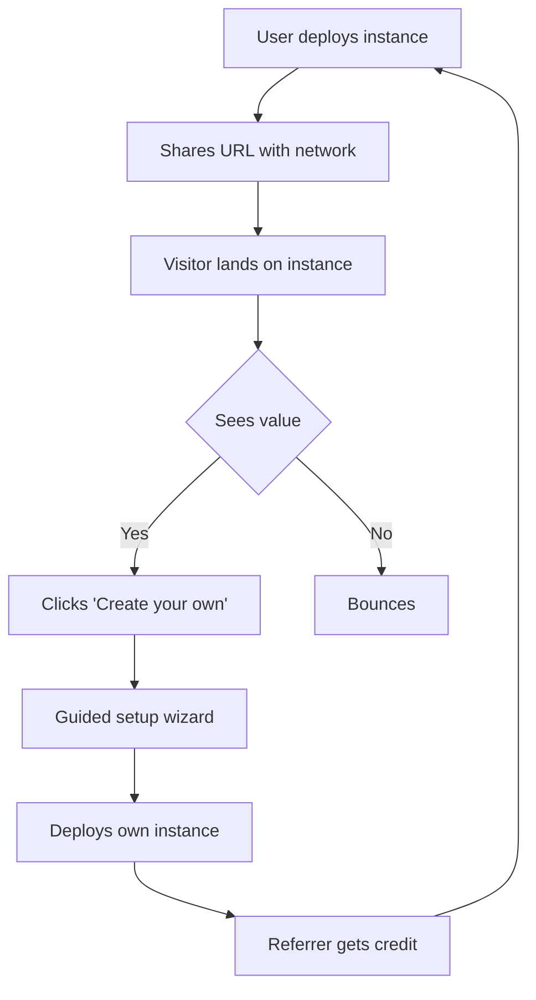
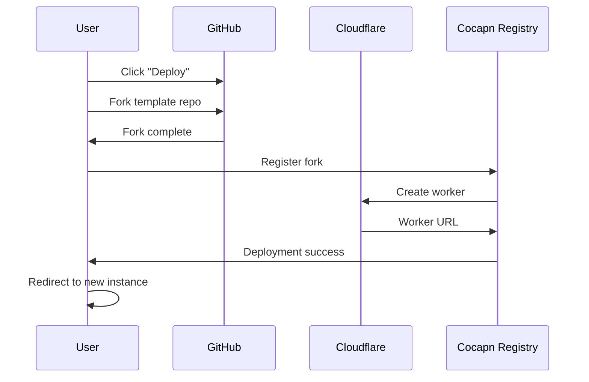
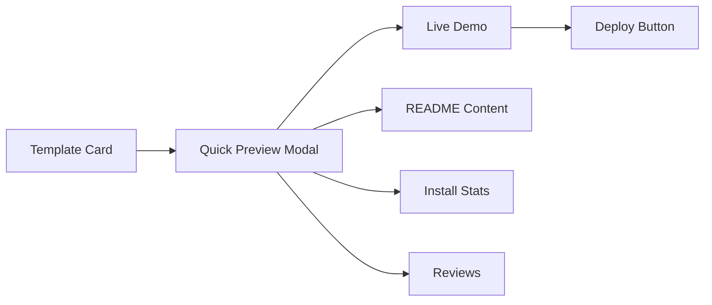
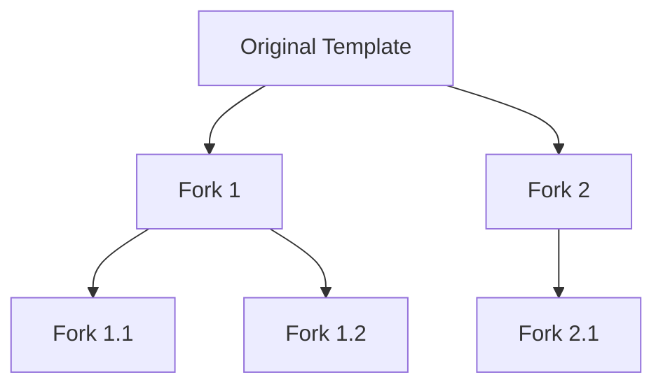

# Cocapn Viral Loop — Growth Engine Design

## 1. Overview

**Viral Loop** — the growth engine that powers cocapn distribution through user-to-user referrals and social sharing.

### Target Experience

```bash
# User deploys their instance
$ cocapn deploy
🚀 Deployed to: https://my-makerlog.magnus-digennaro.workers.dev

# Visitor sees the instance
→ Clicks "Create your own" badge
→ Guided setup wizard
→ Their instance deployed in 60 seconds
→ Original user gets referral credit
```

### Growth Model

- **Initial phase**: Organic growth through shared instances
- **Amplification phase**: Template marketplace + featured instances
- **Sustainment phase**: Community-driven templates + referral rewards

### Key Principles

1. **Frictionless deployment**: Target < 60 seconds from visit to live instance
2. **Attribution everywhere**: Every instance credits its referrer
3. **Social proof**: Public metrics, ratings, and activity feeds
4. **Progressive discovery**: Start simple, discover advanced features over time

---

## 2. The Viral Loop

### 2.1 Loop Stages



### 2.2 Stage Details

| Stage | Action | Conversion Target | Key Metric |
|-------|--------|-------------------|------------|
| **Deploy** | User creates instance | 100% (baseline) | Deployment success rate |
| **Share** | User distributes URL | 40% | Share rate per active user |
| **Land** | Visitor arrives | 100% | Traffic sources |
| **Engage** | Visitor explores instance | 60% | Time on site, actions taken |
| **Convert** | Visitor starts setup | 10% | Click-through rate |
| **Complete** | New instance deployed | 5% | Funnel completion rate |
| **Credit** | Referral attribution | 100% | Attribution accuracy |

### 2.3 Loop Optimization

**Friction reduction:**
- One-click deploy from GitHub template
- Pre-filled configuration from referrer
- Skip optional steps in setup wizard

**Incentive alignment:**
- Referrer badges: "Powered by [user]'s cocapn"
- Leaderboard: Top referrers featured on cocapn.ai
- Analytics: Real-time referral dashboard

**Social proof:**
- Live counter: "X instances deployed this week"
- Recent activity: "Just deployed: [user]'s [template] instance"
- Testimonials: User quotes on landing page

---

## 3. One-Click Deploy

### 3.1 Deploy Button

**Primary placement:**
- cocapn.ai hero section
- Template marketplace cards
- Documentation pages
- GitHub README files

**Button variants:**
```html
<!-- Primary -->
<button class="deploy-btn primary">
  Deploy to Workers.dev
</button>

<!-- Secondary -->
<button class="deploy-btn secondary">
  Fork & Customize
</button>

<!-- Contextual -->
<button class="deploy-btn template">
  Use This Template
</button>
```

### 3.2 GitHub Template Repos

**Template structure:**
```
cocapn-template-[name]/
├── cocapn.yml          # Public config
├── cocapn-private.yml  # Private config (gitignored)
├── soul.md            # Agent personality
├── README.md          # Template description
├── .github/
│   ├── workflows/
│   │   └── deploy.yml  # CI/CD for Workers
│   └── badges/         # Status badges
└── packages/
    └── cloud-workers/  # Worker code
```

**Template metadata (README.md):**
```yaml
---
name: "MakerLog Assistant"
description: "Developer-focused agent with GitHub integration"
author: "Superinstance"
version: "1.0.0"
category: "Development"
tags: ["github", "jira", "documentation"]
demo: "https://makerlog-demo.cocapn.ai"
---
```

### 3.3 Deploy Flow



**Steps:**
1. User clicks deploy button on cocapn.ai
2. GitHub OAuth: Request repo permissions
3. Fork template repo to user's account
4. Cloudflare Workers: Deploy from fork
5. Cocapn registry: Register new instance
6. Redirect user to deployed instance

### 3.4 Deployment Automation

**GitHub Actions workflow:**
```yaml
name: Deploy to Cloudflare Workers
on:
  push:
    branches: [main]
  workflow_dispatch:

jobs:
  deploy:
    runs-on: ubuntu-latest
    steps:
      - uses: actions/checkout@v3
      - name: Deploy to Workers
        uses: cloudflare/wrangler-action@v3
        with:
          apiToken: ${{ secrets.CLOUDFLARE_API_TOKEN }}
          accountId: ${{ secrets.CLOUDFLARE_ACCOUNT_ID }}
```

---

## 4. Referral System

### 4.1 Referral Codes

**Code generation:**
```typescript
// Each instance gets unique referral code
interface ReferralCode {
  code: string;           // e.g., "makerlog-abc123"
  instanceId: string;     // Source instance
  userId: string;         // Instance owner
  createdAt: Date;
  expiresAt?: Date;       // Optional expiration
}

// Code format: {template}-{random}
// Example: "makerlog-xk9d2", "personallog-7m8qp"
```

**Code distribution:**
- URL parameter: `?ref=makerlog-xk9d2`
- Cookie: `cocapn_referral=makerlog-xk9d2`
- QR code: Scannable referral links

### 4.2 Attribution

**Touchpoint tracking:**
```typescript
interface ReferralAttribution {
  referralCode: string;
  sourceUrl: string;           // Where visitor came from
  timestamp: Date;
  converted: boolean;
  instanceCreated?: string;    // New instance ID
  path: string[];              // Pages visited
}
```

**Attribution window:**
- First-touch: 30-day cookie
- Multi-touch: Credit split across referrers
- Last-touch: Final referrer gets credit

### 4.3 Referral UI Components

**Badge on every instance:**
```html
<div class="cocapn-badge">
  
  <span>Powered by cocapn</span>
  <a href="/create-your-own?ref=makerlog-xk9d2">
    Create your own
  </a>
</div>
```

**Referral dashboard:**
```typescript
interface ReferralStats {
  totalClicks: number;
  totalConversions: number;
  conversionRate: number;
  topInstances: {
    instanceId: string;
    instanceName: string;
    clicks: number;
    conversions: number;
  }[];
  recentActivity: {
    timestamp: Date;
    instanceName: string;
    templateUsed: string;
  }[];
}
```

### 4.4 Analytics Implementation

**Event tracking:**
```typescript
// Track referral link click
analytics.track('referral_click', {
  referralCode: 'makerlog-xk9d2',
  sourceUrl: 'https://example.cocapn.ai',
  timestamp: new Date(),
});

// Track conversion
analytics.track('referral_conversion', {
  referralCode: 'makerlog-xk9d2',
  newInstanceId: 'abc123',
  templateUsed: 'makerlog',
  timestamp: new Date(),
});
```

---

## 5. Template Marketplace

### 5.1 Marketplace Structure

**Categories:**
```
cocapn.ai/templates
├── featured           # Curated by Superinstance
├── personal           # Personal assistants
├── business           # Enterprise tools
├── development        # Developer tools
├── education          # Learning & research
├── entertainment      # Games & hobbies
├── health             # Fitness & wellness
├── finance            # Finance & crypto
└── community          # User-submitted
```

**Template card:**
```typescript
interface TemplateCard {
  id: string;
  name: string;
  description: string;
  author: {
    name: string;
    avatar: string;
    url: string;
  };
  thumbnail: string;
  demoUrl: string;
  deployUrl: string;
  stats: {
    installs: number;
    stars: number;
    forks: number;
    rating: number;
  };
  tags: string[];
  featured: boolean;
  updatedAt: Date;
}
```

### 5.2 Discovery Features

**Search:**
- Full-text search: name, description, tags
- Filters: category, rating, installs
- Sort: relevance, popularity, newest, rating

**Preview:**


**Recommendations:**
- "You might like": Based on browsing history
- "Trending": Most installs this week
- "New arrivals": Recently added templates
- "Similar to X": Related templates

### 5.3 Community Features

**Ratings and reviews:**
```typescript
interface TemplateReview {
  id: string;
  templateId: string;
  userId: string;
  userName: string;
  userAvatar: string;
  rating: number;        // 1-5 stars
  title: string;
  content: string;
  createdAt: Date;
  helpful: number;       // Helpful votes
  response?: {
    content: string;
    author: string;      // Template author
    createdAt: Date;
  };
}
```

**Author profiles:**
```typescript
interface TemplateAuthor {
  userId: string;
  userName: string;
  avatar: string;
  bio: string;
  url: string;
  templates: string[];   // Template IDs
  stats: {
    totalInstalls: number;
    totalStars: number;
    avgRating: number;
  };
  verified: boolean;     // Verified by Superinstance
}
```

### 5.4 Submission Process

**Submit template flow:**
1. Author creates template repo on GitHub
2. Author submits to cocapn.ai marketplace
3. Review queue: Superinstance team reviews
4. Approval: Template goes live
5. Analytics: Author gets dashboard

**Submission requirements:**
- Valid cocapn.yml configuration
- Working demo URL
- Comprehensive README
- License file (MIT/Apache recommended)
- Test coverage report

---

## 6. Social Features

### 6.1 Instance Directory

**Directory listing:**
```typescript
interface InstanceListing {
  instanceId: string;
  name: string;
  url: string;
  template: string;
  owner: {
    name: string;
    avatar: string;
  };
  stats: {
    visitors: number;      // Weekly unique visitors
    interactions: number;  // Messages sent
    uptime: number;        // Percentage
  };
  tags: string[];
  category: string;
  featured: boolean;
  createdAt: Date;
}
```

**Directory filters:**
- Category: personal, business, development, etc.
- Activity: active (past 7 days), inactive
- Popularity: top visitors, top interactions
- Template: filter by template used

### 6.2 Activity Feed

**Feed events:**
```typescript
type ActivityEvent =
  | { type: 'deploy'; instanceId: string; template: string; user: string }
  | { type: 'fork'; sourceInstance: string; newInstance: string; user: string }
  | { type: 'update'; instanceId: string; version: string; user: string }
  | { type: 'star'; instanceId: string; user: string }
  | { type: 'review'; templateId: string; rating: number; user: string };

interface ActivityFeed {
  events: ActivityEvent[];
  timestamp: Date;
  cursor?: string;  // Pagination
}
```

**Feed sections:**
- "Following": Activity from followed instances
- "Trending": Most deployed templates
- "Recent": All activity, chronological
- "Featured": Curated by Superinstance

### 6.3 Fork Network

**Fork graph:**


**Fork attribution:**
- Each instance shows: "Forked from X"
- Original author gets attribution credit
- Fork chain is publicly visible
- Authors can see who forked their work

**Contribution back:**
- Pull requests to upstream template
- "Contributed to X" badge on profile
- Featured contributors on template page

### 6.4 Featured Instances

**Curation criteria:**
- High visitor count (top 10%)
- Positive user reviews
- Regular updates
- Innovative use of cocapn features
- Good uptime and performance

**Rotation:**
- Weekly featured instances on homepage
- Monthly "editor's pick" spotlight
- Seasonal features (holiday themes, etc.)

---

## 7. GitHub Integration

### 7.1 Repository Structure

**Template repos:**
```
github.com/cocapn-ai/
├── template-personal-log
├── template-maker-log
├── template-study-log
├── template-dm-log
└── template-business-log

github.com/users/
└── [user-templates]/
```

**Repo metadata:**
- Topics: `cocapn`, `template`, `[category]`
- License: MIT or Apache-2.0
- Badges: Deploy status, test coverage, version
- Links: Live demo, cocapn.ai template page

### 7.2 Social Proof Badges

**Badge types:**
```markdown


```

**Badge placement:**
- README.md top section
- Cocapn.ai template card
- Social media shares
- Documentation pages

### 7.3 GitHub Actions Integration

**CI/CD workflow:**
```yaml
name: Cocapn Template CI

on:
  push:
    branches: [main]
  pull_request:
    branches: [main]

jobs:
  validate:
    runs-on: ubuntu-latest
    steps:
      - uses: actions/checkout@v3
      - name: Validate cocapn.yml
        uses: cocapn-ai/action-validate@v1
      - name: Run tests
        run: npm test
      - name: Check coverage
        uses: cocapn-ai/action-coverage@v1

  deploy:
    if: github.event_name == 'push'
    needs: validate
    runs-on: ubuntu-latest
    steps:
      - name: Deploy to Cloudflare
        uses: cloudflare/wrangler-action@v3
      - name: Register with cocapn.ai
        uses: cocapn-ai/action-register@v1
```

### 7.4 Community Engagement

**GitHub Discussions:**
- Template support forums
- Feature requests
- Show-and-tell: Share your instance
- Community templates

**Issues:**
- Bug reports for templates
- Feature requests for cocapn
- Documentation improvements

**Pull requests:**
- Template improvements
- Bug fixes
- New features
- Documentation updates

---

## 8. Metrics and Analytics

### 8.1 Key Performance Indicators

**Growth metrics:**
| Metric | Description | Target |
|--------|-------------|--------|
| Weekly Active Instances | Instances with ≥1 visitor/week | +20% WoW |
| New Deployments | New instances deployed/week | +15% WoW |
| Referral Conversion | Visitors who deploy/total visitors | 5% |
| Template Installs | Template marketplace installs/week | +10% WoW |
| DAU per Instance | Daily active users per instance | +5% WoW |

**Engagement metrics:**
| Metric | Description | Target |
|--------|-------------|--------|
| Avg Session Duration | Time spent on instance | >3 min |
| Messages per Session | Avg messages sent per session | >5 |
| Return Visitor Rate | Visitors who return within 7 days | >30% |
| Feature Adoption | % using advanced features | >20% |
| Share Rate | % who share their instance | >15% |

### 8.2 Analytics Implementation

**Event tracking:**
```typescript
// Deployment events
analytics.track('instance_deployed', {
  instanceId: string,
  template: string,
  referralCode?: string,
  deployTime: number,  // ms
});

// Engagement events
analytics.track('message_sent', {
  instanceId: string,
  messageType: string,
  timestamp: Date,
});

// Sharing events
analytics.track('instance_shared', {
  instanceId: string,
  platform: 'twitter' | 'linkedin' | 'email' | 'other',
  referralCode: string,
});

// Marketplace events
analytics.track('template_viewed', {
  templateId: string,
  source: 'search' | 'category' | 'featured',
});
analytics.track('template_installed', {
  templateId: string,
  referralCode?: string,
});
```

### 8.3 Dashboard Requirements

**Admin dashboard (Superinstance):**
- Total instances deployed
- Active instances (last 7 days)
- Template popularity ranking
- Referral leaderboard
- Geographic distribution
- Device/platform breakdown
- Conversion funnel analysis

**User dashboard (instance owners):**
- Instance visitor count
- Referral conversions
- Revenue share (if applicable)
- Performance metrics
- Uptime monitoring
- Recent activity log

---

## 9. Landing Page

### 9.1 Page Structure

**Hero section:**
```html
<section class="hero">
  <h1>Your AI Agent, Deployed in 60 Seconds</h1>
  <p class="subtitle">
    Personalized AI assistants with persistent memory.
    Free to start, deploy in seconds.
  </p>
  <div class="cta-group">
    <button class="btn primary">Deploy Now</button>
    <button class="btn secondary">View Demo</button>
  </div>
  <div class="social-proof">
    <span>⚡ 1,234 instances deployed this week</span>
  </div>
</section>
```

**Feature highlights:**
- Fast deployment
- Persistent memory
- Customizable personality
- Fleet communication
- Privacy-first
- Open source

**Template gallery:**
- Featured templates (carousel)
- Template categories
- Quick preview cards
- Deploy buttons

**Social proof:**
- Testimonials
- "Powered by cocapn" showcase
- Live deployment counter
- Company logos (if applicable)

### 9.2 Navigation

**Primary nav:**
- Templates
- Features
- Pricing
- Docs
- Blog

**Secondary nav:**
- Sign in (GitHub OAuth)
- Deploy button

**Footer:**
- About
- Blog
- Careers
- Privacy
- Terms
- Contact

### 9.3 Conversion Optimization

**A/B testing:**
- Hero copy variations
- CTA button colors/text
- Template card layouts
- Pricing page presentation
- Onboarding flow variations

**Exit intent:**
- "Wait! Deploy your first instance in 60 seconds"
- Email capture: "Get deployment tips"
- Template recommendations

**Progressive enhancement:**
- Start with single deploy button
- Show advanced options after first deploy
- Reveal features based on user behavior

---

## 10. Pricing and Monetization

### 10.1 Tiers

| Tier | Price | Features |
|------|-------|----------|
| **Free** | $0 | Workers.dev subdomain, 1 instance, basic analytics |
| **Pro** | $10/mo | Custom domain, 5 instances, advanced analytics, priority support |
| **Team** | $50/mo | 10 instances, team collaboration, SLA, dedicated support |
| **Enterprise** | Custom | Unlimited instances, white-label, on-premise option |

### 10.2 Revenue Sharing

**Template author rewards:**
- 10% of Pro/Team fees for instances using your template
- Payout monthly via Stripe
- Dashboard shows earnings

**Referral bonuses:**
- Free month of Pro for 5 successful referrals
- Pro rewards for 25+ referrals
- Enterprise commission for 100+ referrals

### 10.3 Upgrade Triggers

**Free tier limits:**
- 1 instance only
- Workers.dev subdomain only
- Basic analytics only
- Community support only

**Upgrade prompts:**
- "Need a custom domain? Upgrade to Pro"
- "Want more instances? Upgrade to Team"
- "Need priority support? Upgrade to Pro"

---

## 11. Implementation Roadmap

### Phase 1: Foundation (Weeks 1-2)

**Infrastructure:**
- [ ] Deploy button implementation
- [ ] GitHub template repo setup
- [ ] Cloudflare Workers deployment automation
- [ ] Cocapn registry service

**Core features:**
- [ ] Referral code generation
- [ ] Basic attribution tracking
- [ ] Instance badge component

**Deliverable:** Users can deploy instances with referral tracking

### Phase 2: Marketplace (Weeks 3-4)

**Marketplace:**
- [ ] Template listing page
- [ ] Search and filtering
- [ ] Template detail pages
- [ ] Deploy from marketplace

**Community:**
- [ ] Ratings and reviews
- [ ] Author profiles
- [ ] Submission process

**Deliverable:** Full template marketplace with reviews

### Phase 3: Social Features (Weeks 5-6)

**Discovery:**
- [ ] Instance directory
- [ ] Activity feed
- [ ] Fork network visualization

**Engagement:**
- [ ] Following system
- [ ] Social sharing
- [ ] Featured instances

**Deliverable:** Social features drive community growth

### Phase 4: Analytics & Optimization (Weeks 7-8)

**Analytics:**
- [ ] Event tracking implementation
- [ ] Admin dashboard
- [ ] User dashboard
- [ ] Conversion funnel analysis

**Optimization:**
- [ ] A/B testing framework
- [ ] Performance monitoring
- [ ] User feedback collection

**Deliverable:** Data-driven growth optimization

### Phase 5: Monetization (Weeks 9-10)

**Pricing:**
- [ ] Stripe integration
- [ ] Subscription management
- [ ] Feature gating

**Revenue share:**
- [ ] Author payout system
- [ ] Referral rewards
- [ ] Earnings dashboard

**Deliverable:** Monetization infrastructure live

---

## 12. Success Criteria

### 12.1 90-Day Goals

| Metric | Target | Status |
|--------|--------|--------|
| Active Instances | 500 | 🎯 |
| New Deployments/Week | 50 | 🎯 |
| Referral Conversion | 5% | 🎯 |
| Template Installs | 200 | 🎯 |
| Paying Customers | 20 | 🎯 |

### 12.2 180-Day Goals

| Metric | Target | Status |
|--------|--------|--------|
| Active Instances | 2,000 | 🎯 |
| New Deployments/Week | 150 | 🎯 |
| Referral Conversion | 7% | 🎯 |
| Template Installs | 1,000 | 🎯 |
| Paying Customers | 100 | 🎯 |
| MRR | $1,000 | 🎯 |

### 12.3 365-Day Goals

| Metric | Target | Status |
|--------|--------|--------|
| Active Instances | 10,000 | 🎯 |
| New Deployments/Week | 500 | 🎯 |
| Referral Conversion | 10% | 🎯 |
| Template Installs | 5,000 | 🎯 |
| Paying Customers | 500 | 🎯 |
| MRR | $5,000 | 🎯 |

---

## 13. Risks and Mitigation

### 13.1 Technical Risks

**Risk:** Cloudflare Workers limits
- **Mitigation:** Implement caching, optimize bundle size, use Durable Objects

**Risk:** Scalability bottlenecks
- **Mitigation:** Load testing, auto-scaling, CDN optimization

**Risk:** Downtime affecting growth
- **Mitigation:** Multi-region deployment, health checks, failover

### 13.2 Growth Risks

**Risk:** Low conversion rate
- **Mitigation:** A/B testing, user research, onboarding optimization

**Risk:** Churn after initial deploy
- **Mitigation:** Engagement features, updates, community building

**Risk:** Low-quality instances hurt brand
- **Mitigation:** Quality guidelines, featured curation, reporting system

### 13.3 Business Risks

**Risk:** Cloudflare pricing changes
- **Mitigation:** Multi-cloud strategy, cost monitoring, pricing flexibility

**Risk:** Competitor emerges
- **Mitigation:** Fast iteration, community building, unique features

**Risk:** IP infringement
- **Mitigation:** Clear licensing, content moderation, DMCA process

---

## 14. Future Enhancements

### 14.1 Advanced Features

**Multi-language support:**
- Template translations
- Internationalized landing pages
- Regional marketplaces

**Mobile apps:**
- iOS app for instance management
- Android app for on-the-go access
- Push notifications for activity

**Enterprise features:**
- SSO integration
- Advanced security controls
- Custom branding options
- SLA guarantees

### 14.2 Community Expansion

**Ambassador program:**
- Community leaders get perks
- Speaking opportunities
- Exclusive early access

**Hackathons:**
- Template creation contests
- Feature building competitions
- Prize pools for winners

**Educational content:**
- Tutorial videos
- Best practices guides
- Case studies
- Webinar series

### 14.3 Platform Evolution

**Plugin marketplace:**
- Extend cocapn with plugins
- Third-party developer ecosystem
- Revenue share for plugin authors

**API platform:**
- Public API for integrations
- Partner integrations
- Webhook system

**AI enhancements:**
- Template recommendations
- Automated personality tuning
- Smart configuration suggestions

---

## 15. Appendix

### 15.1 References

**Internal:**
- `docs/designs/deploy-flow.md` — Deployment system
- `docs/designs/template-migration.md` — Template system
- `docs/designs/multi-user-auth.md` — Authentication

**External:**
- [Dropbox referral program case study](https://blog.dropbox.com/topics/company/our-referral-program)
- [Airbnb referral growth strategies](https://growthhackers.com/growth-studies/airbnb)
- [Viral loop best practices](https://www.andrewchen.co/viral-loop-case-study/)

### 15.2 Glossary

| Term | Definition |
|------|------------|
| **Instance** | Deployed cocapn agent with unique URL |
| **Template** | Pre-configured cocapn setup |
| **Referral code** | Unique identifier for attribution |
| **Deployment** | Act of creating a live instance |
| **Conversion** | Visitor becomes instance creator |
| **Fork** | Copy of a template for customization |
| **Badge** | UI component showing "Powered by cocapn" |

### 15.3 Stakeholders

**Primary:**
- Superinstance team
- Template authors
- Instance owners

**Secondary:**
- End users (instance visitors)
- Cloudflare (infrastructure partner)
- GitHub (platform partner)

**Tertiary:**
- Designers
- Contributors
- Advisors

---

**Document version:** 1.0.0
**Last updated:** 2026-03-29
**Author:** Superinstance
**Status:** Design — Awaiting implementation
